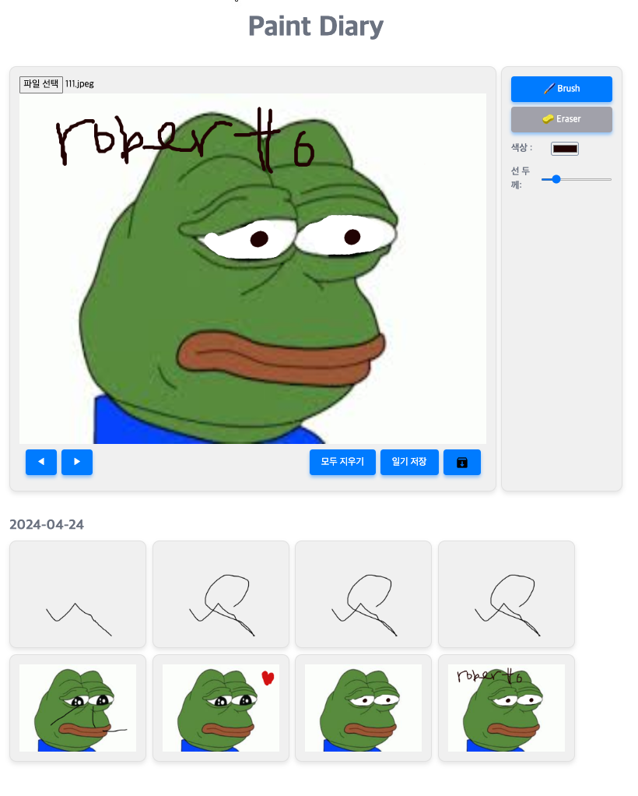

<h1 align="center">canvas diary
</h1>


## 실행
```typescript
    npm install
    npm run start
```

</br>

## 구현기능
```typescript
구현기능 : 

1.이미지 업로드
2.그리기 (그리기 ,지우기 ,색상 ,선두께 )
3.일기 저장 (Localstoage)
4.모두 지우기 (초기화)
5.그리기 실행 되돌리기,앞으로돌리기
6.캔버스 이미지 다운로드
7.일기 조회 (날짜별)
```

</br>


## 실행화면


</br>
</br>

## 구현 및 troubleshooting


> 이미지 업로드 
```typescript
export const useCanvasImgUpload = () => {
    
     createImageBitmap(file)
         .then((imageBitmap) => {
             ...
         }
```
이미지 업로드를 위해 기존엔 FileReader 객체를 사용했습니다 </br>
하지만 비동기적으로 실행되기에 메인스레드의 동작을 </br>
이에 대한 대안으로 메인스레드를 방해하지않고 처리하기위해 createImageBitmap 을 사용했습니다 </br>
또한 GPU에 최적화된 ImageBitmap 을 사용함으로서  캔버스에 이미지를 빠르게 렌더링 할수 있었습니다 </br>
</br>
업로드된 이미지를 관리하기위해 드로윙을 위한 캔버스와 이미지를 렌더하는 캔버스 2개를 사용했습니다 

</br>
</br>


> 그리기

```typescript
export const useCanvasWebWorkerThread = () => {

 useEffect(() => {
  // webworker 생성
  workerRef.current = new Worker('../core/paintWorker.ts')
 ...

  useEffect(() => {
   const offscreen = canvasRef.current.transferControlToOffscreen()
   //webworker 에게 send 
   workerRef.current.postMessage({type: 'setup', canvas: offscreen}, [offscreen])
  }
 }, [])

```

초기에 캔버스 그리기 작업을 메인스레드에서 마우스 이벤트 처리로 진행했습니다 </br>
하지만 메인스레드가 다른 비동기 처리나 모든 이벤트(캔버스 렌더링) 작업을 처리하기엔 무리가 있다판단했습니다 </br>
또한 mdn문서에서도 최적화된 방식으로 Web Worker의 사용을 장려했습니다 </br>
캔버스의 모든 이벤트들을 transferControlToOffscreen 을 이용하여 webWorker 에서 핸들링했습니다 

</br>
</br>

>일기 저장 (Localstoage)
> 
```typescript
export const useCanvasConfirm = (
        
    const saveCanvas = debounce(() => {
     ...
     //일기 저장시 CostomEvent 트리거 
     window.dispatchEvent(new Event('localStorageUpdate'))

```
```typescript
export const CanvasDayList = () => {
  useEffect(() => {
   //CostomEvent 핸들링하여 캔버스 이미지 리스트 조회 콜백 실행 
   window.addEventListener('localStorageUpdate', getImgFromLocalStorage)
     ...

```

일기 저장 버튼을 누르면 로컬스토리지에 현재 캔버스이미지가 저장되게됩니다 </br>
그리고 캔버스 하단에 저장버튼이 눌리면  날짜별 그룹핑을하여 캔버스이미지들이 렌더되야했습닌다 </br>
이에따라 저장 버튼을 누를시 CustomEvent 를 트리거하여 캔버스 하단컴포넌트가 해당 이벤트를 핸들링하여</br>
갱신하도록 조정했습니다

</br>
</br>

>실행취소 , 다시실행 버튼

초기엔 페인트 드로우 마다 그 path 를 모두 배열에 저장했습니다 </br>
그리고 다시 캔버스를 초기화하고 해당배열에 마지막 요소를 삭제(추가)해 다시 그려주는</br>
방식을 사용했습니다. 굉장히 비합리적이라 생각하여 다른 방식을 사용했습니다
캔버스이미지를 스냅샷으로 저장하여 해당 배열을 관리 하는 방식으로 변경했습니다. 
```typescript
export const Canvas = () => {
 const canvasMouseUp = () => {
        takeSnapshot() // workerRef.current?.postMessage({ type: 'snapshot' })
         ...
```
```typescript
src/components/canvas/core/paintWorker.ts

    function snapshotCanvas() {
     const imageData = ctx.getImageData(0, 0, 800, 600)
             ...

```
캔버스에서 마우스가 뗴어지게 되면 해당 캔버스 이미지를 저장합니다</br>
실행취소 , 다시실행 버튼이 눌리게 되면 스냅샷에 저장된 이미지 배열을 핸들링하여 캔버스에 보여줍니다</br>
이미지 배열이 과도하게 커질것을 대비해 배열의 크기가 30개이면 가장 처음 index 를 삭제후 추가합니다</br>
(배열은 30개 이하로 항상유지 )

</br>
</br>

## 시간이 남았더라면..

### 현재는 캔버스  전체를 핸들링 하고있습니다 그러나 캔버스 상태가 변한부분만을  저장하여 핸들링 하는 방식으로 수정해야합니다 

